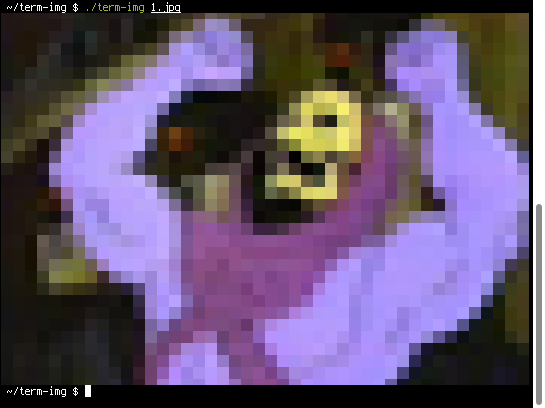

# term-img

View images in a terminal.

## Requirements

Minimal, you probably already have most of these installed (maybe not PIL).

- *A terminal that supports...*
    - True color (24-bit / 16 million colors). [Most terminals](https://gist.github.com/XVilka/8346728) support true color, but if you're unsure, run: `echo $COLORTERM`
    - Unicode as well as a Unicode font. At the least, you need the lower half block character: ▄ (U+2584)
- Python 3
- [Pillow / PIL](https://python-pillow.org) for Python 3 (`python3-pil` in Debian / Ubuntu). *Not to be confused with regular PIL for Python 2*
- tput

## Screenshots

<table><tr>
<td></td>
<td></td>
</tr></table>

## See Also

- [PIXterm](https://github.com/eliukblau/pixterm) - Go implementation
- [termpix](https://github.com/hopey-dishwasher/termpix) - Rust implementation
- [libcaca](https://github.com/cacalabs/libcaca)'s [img2txt](https://linux.die.net/man/1/img2txt)

## License

Licensed under the [MIT license](https://github.com/keithieopia/term-img/blob/master/LICENSE).

*This is free software: you are free to change and redistribute it. There is NO WARRANTY, to the extent permitted by law.*
